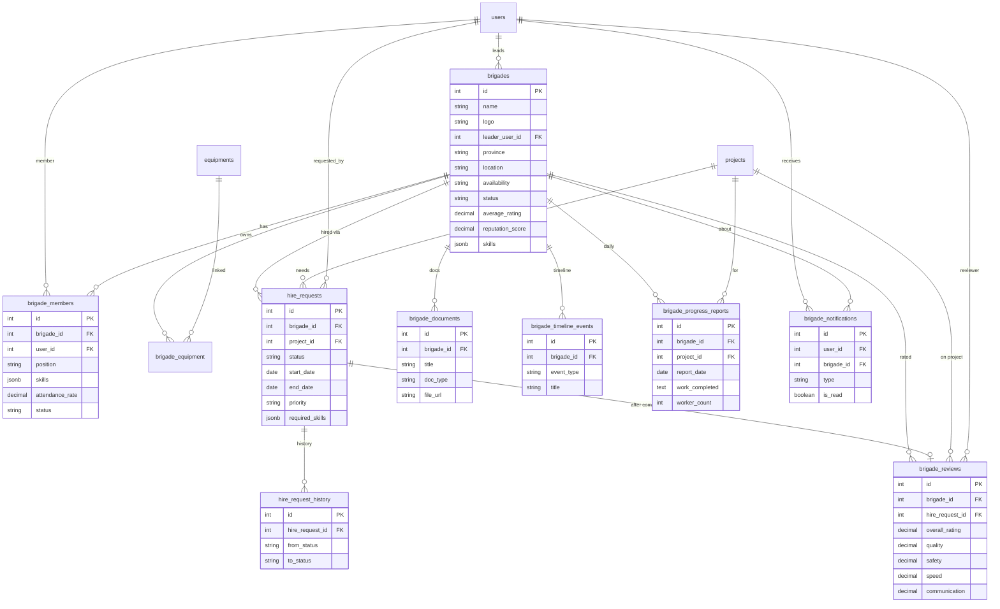

# Brigada Module ERD



## Reputation formula

```
score =
  40% × (average_rating / 5 × 100)
+ 20% × min(completed_tasks / 50 × 100, 100)
+ 15% × completion_rate
+ 10% × safety_score
+ 10% × attendance_score
+  5% × response_time_score (faster = higher)
```

Result clamped to **0–100**.
